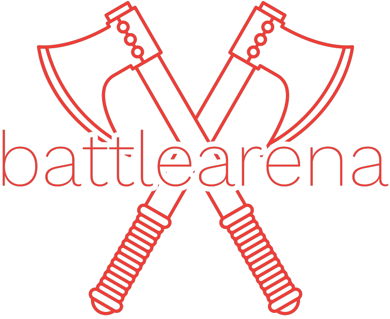

<p align="center">
  
</p>

> **Note**
> This Readme is a WIP and will be continuously updated as project grows.

# Battle Arena

This is a project which has been on my mind for sometime. It is an eSports/gaming tournament tracking platform which i am building to learn some concepts related to product engineering in general. This is the front-end. The backend code can be found at: https://github.com/archdemon-developer/battle-arena-backend

## Technologies Used

Technologies used in this project are:

- HTML
- CSS
- React
- typescript
- vite
- Redux
- Firebase Authentication
- Wouter
- Vitest
- React Hook Form
  (Technologies used will be updated here as and when added).

## Installation

First, clone this project using git, and navigate into the project folder:

```bash
  git clone https://github.com/archdemon-developer/battle-arena-ui.git
  cd battle-arena-ui
```

Then, install the required dependencies

```bash
  npm install
```

That's it! Start the dev server using

```bash
  npm start
```

Build the project using

```bash
  npm run build
```

## Running Tests

This project uses Vitest for unit testing. To run the tests, run the following command:

```bash
  npm run test
```

If you want to see your test coverage, then run:

```bash
  npm run coverage
```

## Linting & Formatting

If you want to run a type check, you can run:

```bash
  npm run type-check
```

For linting, run:

```bash
  npm run lint
```

For formatting the code (the project uses prettier), run:

```bash
  npm run format
```

## Roadmap

**Things to keep in mind:**

- Cross-browser compatibility (CSS reset, mobile-first development, etc).
- Modular code - Adhere to Vue.js coding practices wherever possible.
- Clean coding practices
- Unit testing

**Essential Features:**

User flow:

- Account access (Sign Up, Login) - - In progress
- backend support (as part of a different project, mostly node.js, thinking microservices)
- Team creation
- Team members addition
- Sign in flow - can sign in as individual or as team member.
- Enter tournaments
- Search tournaments
- User/team profile edit
- Filtering
- Leaderboards
- Reporting cheaters

Admin Flow:

- Add tournaments
- Leaderboards
- User/Team management - mainly for moderation purposes

**Optional Features**

Will update this as i think of more usecases.

## Acknowledgements

- [Readme.so](https://readme.so/) - To help create this readme.
- [React.js](https://react.dev/) - The framework for this app.
- [Vitest](https://vitest.dev/) - For testing the project, excellent testing package with seamless integration with vue js.
- [Make your logo](https://app.logo.com/business-name) - To make the simple logo for this project.
- [Mordern CSS Reset](https://andy-bell.co.uk/a-modern-css-reset/) - To reset the css styles.
- [My Color](https://mycolor.space/?hex=%23FF5858&sub=1m) - For the really nice color palletes.
- [Font Awesome Icons](https://fontawesome.com/) - For the icons to be used as part of this project.
